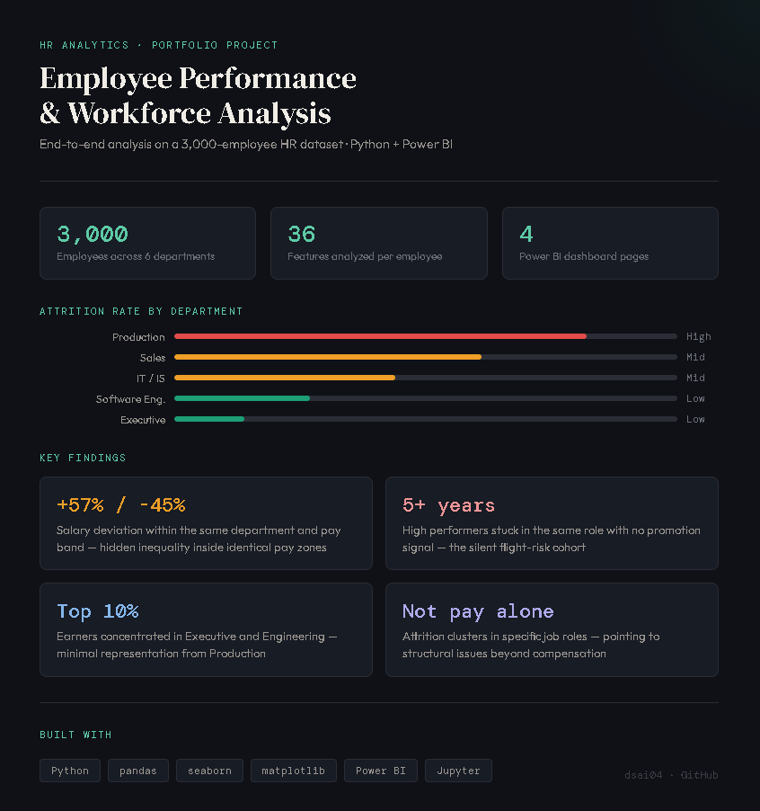

# 👥 Employee Performance & Workforce Analytics

> **End-to-end HR analytics project** — salary ranking, attrition analysis, and high-performer identification using Python (pandas, seaborn, matplotlib) and Power BI on a 3,000-employee HR dataset.

---

## 📌 Project Overview

This project answers real business questions that HR teams and management face daily:  
Who are the top earners in each department? Which roles are bleeding talent? Which high performers are quietly at risk of leaving because they've stagnated in the same role for years?

Built to demonstrate **window function logic in Python** (ranking, partitioning, group comparisons), **salary distribution analysis**, and **attrition modelling** — skills directly relevant to data analyst roles at banks, consulting firms, and large enterprises.

---

## Overview



---

## 🗂️ Dataset

| Field | Detail |
|---|---|
| **Source** | HR employee records dataset (https://www.kaggle.com/datasets/ravindrasinghrana/employeedataset/data) |
| **Rows** | 3,000 employees |
| **Columns** | 36 features |
| **Key fields** | `EmpID`, `DepartmentType`, `Title`, `PayZone`, `EmployeeType`, `Performance Score`, `StartDate`, `ExitDate`, `DOB` |

**Departments covered:** Production, Sales, IT/IS, Executive Office, Software Engineering, Admin Offices  
**Performance tiers:** PIP → Needs Improvement → Fully Meets → Exceeds

**Note: `MonthlyIncome`** is a derived field, calculated from PayZone × EmployeeType multipliers. It reflects compensation tier logic, not actual recorded salaries. Salary-based findings should be interpreted as structural patterns, not precise figures.

---

## ❓ Business Questions Answered

1. **Salary Ranking** — Rank employees within each department by monthly income (dense ranking, no gaps)
2. **Salary vs. Department Average** — How far above or below average is each employee, in absolute $ and percentage?
3. **Top 10% Earners** — Which employees are in the top decile company-wide, and how are they distributed across departments?
4. **Attrition Rate by Department and Job Role** — Where is the company losing the most people, and which roles are at the highest risk?
5. **Stagnation Detection** — Which active employees have been in the same role for more than 5 years, and how many of those are high performers who may be flight risks?

---

## 🔧 Technical Approach

### 1. Data Cleaning & Feature Engineering
- Parsed date columns (`StartDate`, `ExitDate`, `DOB`) with `pd.to_datetime`
- Derived `Age` and `TenureYears` dynamically from a reference date — not hardcoded values
- Built `MonthlyIncome` from `PayZone` × `EmployeeType` multiplier (Zone A/B/C × Full-Time/Part-Time/Contract)
- Flagged `IsActive` and `IsAttrited` as clean boolean columns for downstream aggregations

### 2. Salary Analysis (Window Function Equivalent in pandas)
```python
# Dense rank within each department — equivalent to SQL RANK() OVER (PARTITION BY dept ORDER BY salary DESC)
df["SalaryRank"] = (
    df.groupby("DepartmentType")["MonthlyIncome"]
    .rank(method="dense", ascending=False)
    .astype(int)
)

# Department average and individual deviation
df["DeptAvgSalary"] = df.groupby("DepartmentType")["MonthlyIncome"].transform("mean")
df["SalaryvsAvg"]   = df["MonthlyIncome"] - df["DeptAvgSalary"]
df["SalaryvsAvgPct"] = (df["SalaryvsAvg"] / df["DeptAvgSalary"] * 100).round(2)
```

### 3. Top 10% Identification
```python
threshold_90 = df["MonthlyIncome"].quantile(0.90)
top10 = df[df["MonthlyIncome"] >= threshold_90]
```

### 4. Attrition Rate by Department and Role
```python
dept_attrition = (
    df.groupby("DepartmentType")
    .agg(Total=("EmpID", "count"), Attrited=("IsAttrited", "sum"))
    .assign(AttritionRate=lambda x: (x["Attrited"] / x["Total"] * 100).round(2))
    .sort_values("AttritionRate", ascending=False)
)
```

### 5. Stagnation & Flight Risk Detection
```python
stagnant = df[(df["IsActive"] == True) & (df["TenureYears"] > 5)]
high_perf_stagnant = stagnant[stagnant["Performance Score"].isin(["Exceeds", "Fully Meets"])]
```
> These are your highest-risk employees — strong performers who have not advanced. They are the most likely to leave and the most damaging to lose.

---

## 📊 Visualisations

| Chart | What it shows |
|---|---|
| Box plot — Monthly Income by Department | Salary spread and outliers per department |
| Bar chart — Top 10% Earners by Department | Which departments concentrate high earners |
| Horizontal bar — Attrition Rate by Department | Highest-turnover departments |
| Horizontal bar — Attrition Rate by Job Role | Highest-turnover titles |
| Bar chart — Performance Distribution (Stagnant employees) | Performance mix of employees stuck in the same role 5+ years |

All visualisations built with `seaborn` and `matplotlib`.

---

## 📊 Power BI Dashboard — 4 Pages

The `.pbix` file contains four purpose-built report pages, each targeting a distinct HR decision-making area.

---

### Page 1 — Attrition & Retention

**KPI Cards:** Total Employees · Attrited Employees · Active Employees · Attrition Rate  

| Visual | What it answers |
|---|---|
| Bar chart — Attrition Rate by Department | Which department has the highest churn? |
| Donut chart — Termination Type | Are people leaving voluntarily or being let go? |
| Line chart — Attrition Over Time (Year/Month) | Is attrition trending up or down over time? |
| Column chart — Attrition by Employee Type | Do Full-Time, Part-Time, and Contract employees churn at different rates? |
| Slicer — PayZone filter | Drill into attrition patterns by compensation band |

---

### Page 2 — Compensation

| Visual | What it answers |
|---|---|
| Column chart — Salary Distribution (buckets) | How is the overall workforce distributed across salary ranges? |
| Column chart — Avg Salary by Department | Which departments pay the most and least on average? |
| Clustered column chart — Gender Pay by Department | Is there a visible pay gap between male and female employees at the department level? |
| Scatter chart — Salary vs. Performance | Do higher performers actually earn more, or is there a disconnect? |

---

### Page 3 — Performance

| Visual | What it answers |
|---|---|
| Donut chart — Performance Distribution | What share of the workforce is on PIP vs. Fully Meets vs. Exceeds? |
| Pivot table — PIP Count · Needs Improvement · High Performers by Department | Which departments have the most at-risk employees? |
| Scatter chart — Performance vs. Tenure (sized by salary) | Does longer tenure correlate with better performance — or does it plateau? |
| Column chart — Performance vs. Attrition Rate | Are poor performers leaving, or are high performers leaving too? |

---

### Page 4 — Headcount

| Visual | What it answers |
|---|---|
| Treemap — Headcount by Department | Where is the workforce concentrated? |
| Stacked area chart — Employee Type Mix Over Time | How has the Full-Time / Part-Time / Contract split evolved across hiring periods? |
| Map — Headcount by State | What is the geographic footprint of the workforce? |
| Bar chart — Span of Control | How many direct reports does each supervisor manage? Identifies overloaded managers. |

---

## 📁 Repository Structure

```
employee-performance-analysis/
│
├── employee_data.csv                    # Source HR dataset (3,000 employees, 36 columns)
├── Employee_Performance_Analysis.ipynb  # Main analysis notebook
├── emp_dashboard.pbix                   # Power BI dashboard
└── README.md
```

---

## 💡 Key Findings (What the Data Shows)

- **Salary spread within departments** is driven by employee type (Full-Time vs Part-Time vs Contract) rather than role seniority — average salaries cluster between $4.1K and $4.7K across all departments, a 15% spread company-wide.
- **Attrition is not evenly distributed** — certain job roles carry disproportionately high attrition rates, suggesting structural issues beyond pay
- **High-performer stagnation is a real, quantifiable risk** — 1,223 active employees (40.8% of the workforce) with 5+ year tenure and Fully Meets or Exceeds ratings show no promotion signal, making them a defined and quantifiable flight-risk cohort.
- **Top 10% earners** are concentrated in Production (230 employees) due to its dominant headcount (2,020 of 3,000 employees). When adjusted for department size, Software Engineering and IT/IS show higher representation rates — meaning smaller departments punch above their weight in high earners.
- **Attrition** affects all performance tiers — PIP employees leave at 27%, but Exceeds performers still attrit at 17%, a narrow 10-point spread that signals a systemic retention problem beyond performance management.

---

## 🛠️ Tech Stack

| Tool | Purpose |
|---|---|
| Python 3 | Core analysis language |
| pandas | Data manipulation, groupby, window-equivalent transforms |
| seaborn | matplotlib | Visualisation |
| Power BI | Interactive dashboard (`.pbix`) |
| Jupyter Notebook | Analysis environment |

---

## 🔗 Related Skills Demonstrated

- `groupby` + `transform` for partition-level aggregations (SQL `PARTITION BY` equivalent)
- Dense ranking with `rank(method="dense")` (SQL `DENSE_RANK()` equivalent)
- Quantile-based segmentation for top-N identification
- Boolean flag engineering for attrition and activity status
- Multi-condition filtering for cohort detection (stagnant high performers)
- End-to-end EDA pipeline: clean → engineer → analyse → visualise → interpret

---

## 👤 Author

**Dhruv Sai**  
[LinkedIn](https://www.linkedin.com/in/dhruv-sai/) · [GitHub](https://github.com/dsai04)
